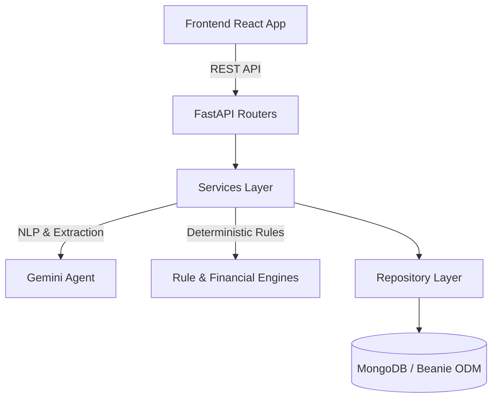

# Target Architecture

## Dependency Graph



## Final Target Tree (Achieved)

```
backend/
├── app/
│   ├── api/             # API Routers (Auth, Chat, Schemes)
│   ├── compatibility/   # Legacy route adapters
│   ├── agent/           # LLM interaction (Gemini clients, Sanitization)
│   ├── engine/          # Deterministic logic (Eligibility, Financial math)
│   ├── models/          # Beanie ODM Database Models & Pydantic Schemas
│   ├── repositories/    # Database abstraction layer
│   ├── services/        # Core business logic orchestrating agents & engines
│   ├── core/            # Config, Security, DB initialization
│   └── main.py          # FastAPI application entrypoint
├── tests/               # Pytest suite (104 tests)
├── pyproject.toml       # Project metadata and dependencies
└── uv.lock              # Lockfile
```

## Technical Decisions
1. **Beanie ODM**: Chosen over raw Motor to enforce type safety and schema validation at the database level.
2. **FastAPI**: Provides automatic OpenAPI documentation, async support out of the box, and strict Pydantic integration.
3. **uv**: Replaced `pip` and Docker for ultra-fast dependency management and virtual environment resolution.
