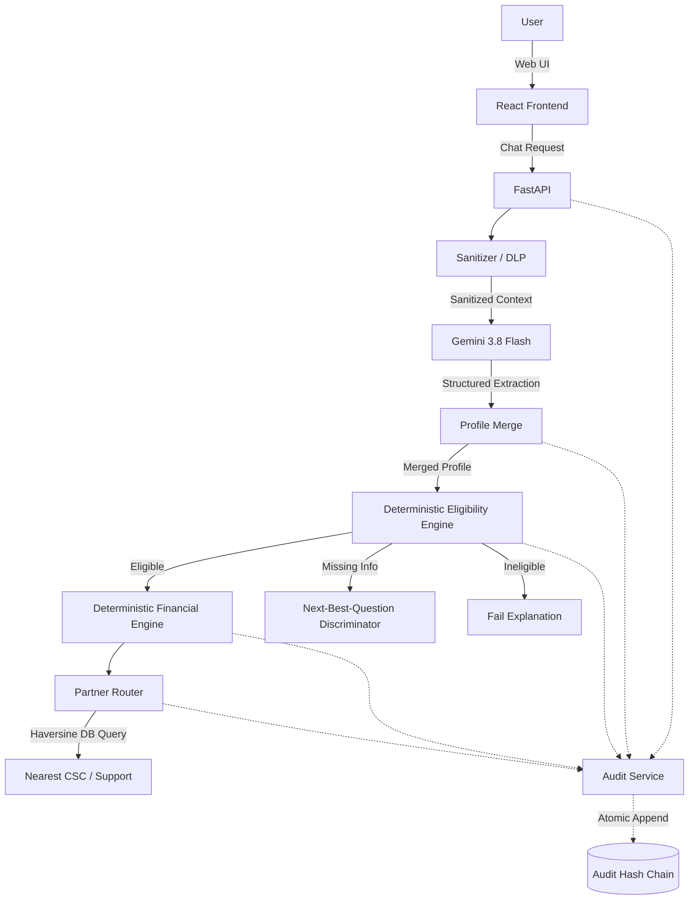

# Data Flow Architecture

```mermaid
graph TD
    USER[User] -->|Web UI| UI[React Frontend]
    UI -->|Chat Request| API[FastAPI]
    
    API --> SAN[Sanitizer / DLP]
    SAN -->|Sanitized Context| LLM[Gemini 3.8 Flash]
    LLM -->|Structured Extraction| PM[Profile Merge]
    
    PM -->|Merged Profile| ELIG[Deterministic Eligibility Engine]
    
    ELIG -->|Eligible| FIN[Deterministic Financial Engine]
    ELIG -->|Missing Info| NEXT[Next-Best-Question Discriminator]
    ELIG -->|Ineligible| REJ[Fail Explanation]
    
    FIN --> ROUTE[Partner Router]
    ROUTE -->|Haversine DB Query| CSC[Nearest CSC / Support]
    
    %% Audit Side Channel
    API -.-> AUDIT[Audit Service]
    PM -.-> AUDIT
    ELIG -.-> AUDIT
    FIN -.-> AUDIT
    ROUTE -.-> AUDIT
    
    AUDIT -.->|Atomic Append| CHAIN[(Audit Hash Chain)]
```
